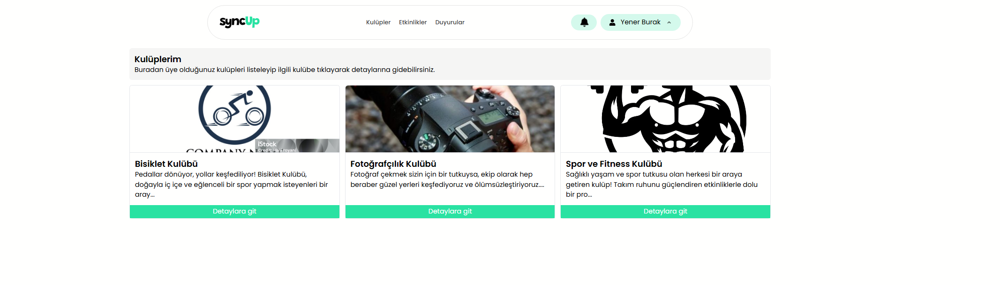
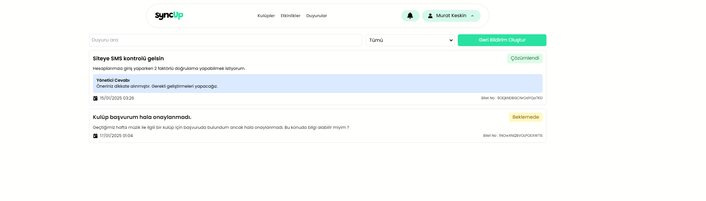

# SyncUp - Üniversite Öğrenci Kulüpleri Sosyal Platformu

SyncUp, üniversite öğrencilerinin kulüp aktivitelerini yönetmelerine, etkinliklere katılmalarına ve kampüs hayatını daha interaktif hale getirmelerine olanak sağlayan bir sosyal platformdur.

## Özellikler

### Kullanıcı Tipleri

1. **User (Öğrenci)**
   - Kulüplere başvuru yapma
   - Etkinliklere katılma
   - Duyuruları takip etme
   - Profil güncelleme
   - Başvuru durumlarını görüntüleme
   - Katıldığı etkinlikleri görüntüleme
   - Bildirimleri yönetme

2. **Leader (Kulüp Lideri)**
   - User'ın tüm özelliklerine ek olarak:
   - Kulüp yönetim paneline erişim
   - Üye yönetimi (ekleme, çıkarma, liderlik verme)
   - Üye başvurularını değerlendirme
   - Kulüp adına duyuru ve etkinlik oluşturma
   - Kulüp bilgilerini güncelleme

3. **Admin (Sistem Yöneticisi)**
   - Tüm kullanıcı, kulüp ve etkinlikleri görüntüleme ve yönetme
   - Kullanıcı/Kulüp/Etkinlik pasifleştirme
   - Kulüp açma başvurularını değerlendirme
   - Geri bildirimleri yönetme
   - Sistem genelinde duyuru yayınlama

## Teknoloji Yığını

- **Frontend**: React.js
- **Stil**: Tailwind CSS
- **State Yönetimi**: Redux Toolkit
- **Backend ve Veritabanı**: Firebase
- **Routing**: React Router
- **Bildirimler**: React Hot Toast
- **Form Yönetimi**: React Hook Form
- **Validasyon**: Zod

## Ekran Görüntüleri

### Üye / User Paneli
Bu panel tüm kullanıcı tiplerinin görebildiği özellikleri barındırır.

1. **Ana Ekran**

   Ana sayfa ekranında, kullanıcıların genel platform aktivitelerine ulaşabileceği özet bir görünüm sunulmaktadır.

2. **Kulüpler**

   Tüm kulüplerin listelendiği ve kullanıcıların kulüpler hakkında bilgi alıp başvuru yapabileceği bölümdür.

3. **Etkinlikler**

   Platformda düzenlenen tüm etkinliklerin görüntülendiği ve kullanıcıların katılım sağlayabileceği alandır.

4. **Duyurular**

   Kullanıcıların platform genelindeki duyuruları takip edebileceği bölümdür.

5. **Bildirimler-1**

   Aşağı açılır bildirim çubuğu, kullanıcıların en son bildirimlerini hızlıca görüntülemesini sağlar.

6. **Bildirimler-2**

   Tüm bildirimlerin detaylı bir şekilde listelendiği bölümdür.

7. **Profil Düzenleme**

   Kullanıcının kendi profil bilgilerini düzenleyebildiği alandır.

8. **Başvurularım-1**

   Kullanıcının yaptığı kulüp başvurularını takip edebildiği ve durumlarını görebildiği sayfadır.

9. **Başvurularım-2**

   Kullanıcının etkinlik veya üyelik başvurularını görüntüleyebildiği bölümdür.

10. **Kulüp Liderliği Başvurusu**

   Kullanıcıların kulüp liderliği başvurusu yapabileceği formun bulunduğu alandır.

11. **Geçmiş Etkinlikler**

   Kullanıcının daha önce katılım sağladığı etkinliklerin görüntülendiği bölümdür.

12. **Kuluplerim**

   Kullanıcının üyesi olduğu kulüplerin listesini ve detaylarını görebileceği bölümdür.

13. **Geri Bildirimler**

   Kullanıcının platforma gönderdiği geri bildirimleri görüntüleyebildiği ve gerektiğinde düzenleyebildiği alandır.

## Lider / Leader Paneli
Bu panel bir kulübün liderliğini yapan kullanıcılar tarafından görüntülenebilir.

1. **Lider Arayüz**

   Kulüp liderlerinin kulüp yönetim süreçlerini kolayca takip edebileceği ana yönetim arayüzüdür.

2. **Lider Kulüpleri**

   Kulüp liderinin yöneticisi olduğu tüm kulüplerin listelendiği ve detaylarına erişilebildiği alandır.

3. **Kulüp Üyeleri Görüntüleme**

   Kulüp üyelerinin listelendiği ve liderin üyeler üzerinde işlem yapabildiği sayfadır.

4. **Kulüp Etkinlikleri Görüntüleme**

   Kulüp kapsamında düzenlenen etkinliklerin listelendiği ve detaylarına ulaşılabildiği bölümdür.

5. **Kulüp Etkinlik Oluşturma**

   Kulüp adına etkinlik oluşturma ve düzenleme işlemlerinin yapıldığı bölümdür.

6. **Kulüp Üye Başvurularını Görüntüleme**

   Kulübe yapılan üyelik başvurularını detaylı bir şekilde görüntüleyebileceğiniz alandır.

7. **Kulüp Üye Başvurularını Onaylama / Reddetme**

   Kulüp üyelik başvurularını onaylama ya da reddetme işlemlerinin yapıldığı bölümdür.

8. **Kulüp Duyuruları**

   Kulübe ait tüm duyuruların listelendiği ve yönetildiği alandır.

9. **Kulüp Duyuru Oluşturma**

   Kulüp adına duyuru oluşturma ve yayınlama işlemlerinin yapıldığı sayfadır.

10. **Kulüp Ayarları**

   Kulüp bilgilerinin düzenlenebileceği ve liderlik yetkilerinin ayarlanabileceği bölümdür.

11. **Kulüp Ayarları Güncelleme**

   Kulüp bilgilerinin detaylı bir şekilde düzenlenebildiği alandır.

## Yönetici / Admin Paneli
Bu panel yalnızca SyncUp'ın yönetici rolüne sahip kullanıcılar tarafından görüntülenebilir.

1. **Arayüz Sayfası**

   Sistemin genel durumunu özetleyen bilgiler ve metriklerin bulunduğu ana yönetim ekranıdır.

2. **Kullanıcılar Sayfası**

   Platformdaki tüm kullanıcıların bilgilerini listeleyen ve düzenlenebildiği yönetim sayfasıdır.

3. **Kulüpler Sayfası**

   Sistemde kayıtlı tüm kulüplerin bilgilerini ve detaylarını görüntüleme ve düzenleme işlemlerinin yapıldığı alandır.

4. **Etkinlikler Sayfası**

   Platformda düzenlenen tüm etkinliklerin yönetildiği ve düzenlendiği sayfadır.

5. **Duyurular Sayfası**

   Tüm duyuruların listelendiği ve yeni duyuru eklenebilen yönetim ekranıdır.

6. **Geri Bildirimler**

   Kullanıcılardan gelen geri bildirimlerin listelendiği ve yönetim tarafından yanıtlanabildiği alandır.

7. **Kulüp Onayları**

   Yeni kulüp oluşturma başvurularının değerlendirildiği ve onaylanıp/reddedildiği yönetim sayfasıdır.
